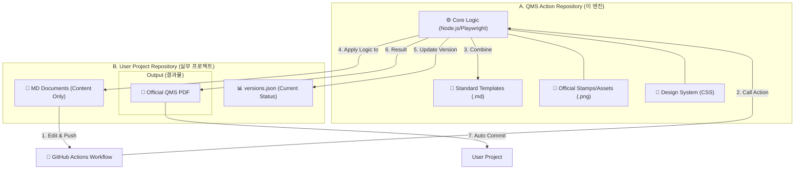

# QMS Digital-Auto-Doc 🚀

> **"Git 승인이 완료되면 도장이 찍힌 공식 PDF가 생성되는 자동화 체계"**

## 📥 최신 공식 문서 다운로드 (Direct)
CI/CD를 통해 검증되고 인장이 찍힌 최신 PDF 문서를 바로 다운로드하세요.

👉 **[[최신 공식 PDF 직접 다운로드 (Latest Release)]](https://github.com/mannMae/auto-qms-test/releases/latest)**

---

## 📄 문서 확인 방법 (GitHub 환경)
1.  **Direct Download (추천)**: 위 링크의 **Releases** 페이지에서 `Assets` 항목의 PDF 파일을 클릭하여 즉시 다운로드합니다.
2.  **Actions Artifacts**: [Actions](https://github.com/mannMae/auto-qms-test/actions) 탭에서 특정 빌드 기록을 클릭한 후, 최하단의 **Artifacts** 섹션에서 꾸러미를 받을 수 있습니다.

---

## 🏗️ Architecture & Core Concepts

본 프로젝트는 **"GitHub Action 기반의 QMS 전용 엔진"**으로 동작하며, 개별 프로젝트 레포지토리와 연동되어 기술 문서의 형식을 일관되게 관리합니다.

### 1. 시스템 구조 (Action vs User Project)

### 2. 주요 스크립트 역할 (Core Logic)
- **`ci-selective-update.js`**: 변경된 파일만 감지하여 효율적으로 PDF를 굽고 버전을 상향합니다.
- **`generate-pdf.js`**: 마크다운을 공식 양식에 맞춰 고품질 PDF로 변환합니다.
- **`auto-draft-template.js`**: 참고용 PDF를 분석하여 새로운 마크다운 초안을 자동 생성합니다.

### 4. Lifecycle of QMS Document

문서의 생애주기는 설계 단계와 자동화 발행 단계로 나뉩니다.

#### **Phase 0: 템플릿 설계 (Design Time & Auto-Drafting)**
*신규 문서 양식 도입 시 1회 수행*
1. **Reference Input**: 표준 양식 PDF를 `references/` 폴더에 업로드 및 푸시.
2. **Auto Analysis**: CI가 새 파일을 감지하면 `scripts/auto-draft-template.js`가 즉시 실행됨.
3. **Draft Generation**: 시스템이 분석 결과를 바탕으로 `templates/DRAFT_*.md` 초안을 자동 생성하여 저장소에 푸시.
4. **Final Design**: 인간 설계자가 초안을 확인하고 레이아웃 및 스타일(CSS) 보정 후 확정.

#### **Phase 1: 자동 발행 (Run Time / CI)**
*매 Push 또는 PR 머지 시 자동 수행*
1. **Change Detection**: 수정된 `docs/*.md` 또는 `templates/*.md` 파일 감지.
2. **Variable Injection**: 해당 마크다운 세부 내용과 매칭된 템플릿 결합.
3. **Signature Overlay**: `assets/stamps/`의 인장 이미지를 활용해 전자 서명 자동 주입.
4. **Official Release**: 고품질 PDF 생성 후 **GitHub Releases**에 최신 공식 버전으로 등록.

---

## 1. 프로젝트 개요
의료기기 QMS 문서 자동화 시스템을 위한 실험적 프로젝트입니다. 마크다운으로 작성된 SDP(소프트웨어 개발 계획서)를 승인 로그와 함께 공식적인 PDF로 변환하는 시스템을 구축합니다.

## 2. 핵심 기술 스택
- **Runtime**: Node.js
- **PDF Engine**: Playwright 또는 Puppeteer (Chromium 기반의 고품질 PDF 렌더링)
- **Converter**: Markdown -> HTML -> PDF
- **Styling**: Vanilla CSS (Print Media Query)
- **CI/CD**: GitHub Actions

## 3. 주요 구현 단계 (Milestones)

### 단계 1: 마크다운 템플릿 설계
- **목표**: 의료기기 표준 형식을 갖춘 `sdp_template.md` 작성.
- **포함 사항**: 
    - 표지 (Cover Page)
    - 개정 이력 (Revision History)
    - 서명란 테이블 (Signature Table)
- **기능**: `{{REVISION}}`, `{{DATE}}`, `{{APPROVER}}` 등 변수 치환 로직.

### 단계 4: CI/CD 연동 (GitHub Actions)
- **목표**: Pull Request가 Merge 될 때 자동으로 상기 스크립트를 실행하여 PDF를 생성하고 저장.

## 📂 폴더 구조 및 역할
| 폴더/파일 | 역할 |
| :--- | :--- |
| `scripts/` | 핵심 변환(PDF) 및 버전 관리 로직 |
| `templates/` | 공식 문서 양식(SDP, SRS 등) 및 스타일 파일 |
| `assets/` | 서명 인장, 로고 등 공통 자산 |
| `action.yml` | GitHub Action 설정 정의 |
| `Dockerfile` | Playwright 실행 환경 |
| `docs/` | (예시용) 실제 작성될 QMS 문서 소스 |
| `output/` | (예시용) 생성된 PDF 저장 폴더 |
