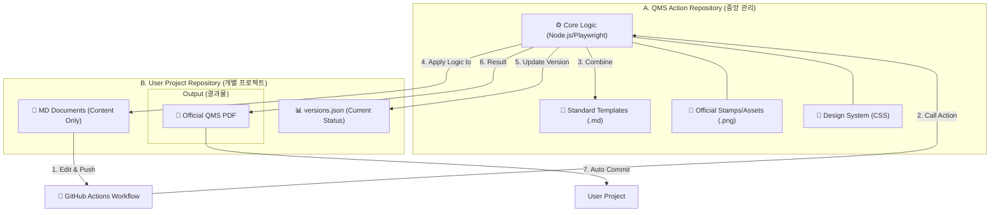

# Auto-QMS GitHub Action 구조도

이 문서는 **Auto-QMS** 시스템을 GitHub Action으로 구성했을 때의 아키텍처와 데이터 흐름을 설명합니다.

## 1. 시스템 개념도 (Mermaid)

---

## 2. 구성 요소 상세 설명

### A. QMS Action Repository (중앙 관리자)
이 레포지토리는 회사의 품질 관리 **기준(Standard)**과 **도구(Engine)**를 저장합니다.
- **로직 (Logic)**: 마크다운 분석, 플레이라이트(Playwright) 제어, PDF 변환 알고리즘.
- **템플릿 (Templates)**: 공식 SDP, SRS, V&V 문서 등의 표준 마크다운 양식.
- **자산 (Assets)**: 승인권자의 서명/도장 이미지, 회사 로고, 폰트.
- **장점**: 양식 변경 시 이 레포지토리만 수정하면 모든 프로젝트에 일괄 적용됩니다.

### B. User Project Repository (실무 개발팀)
실제 제품 개발이 이루어지는 곳으로, **데이터(Content)**만 관리합니다.
- **문서 내용 (Content)**: `.md` 파일로 작성된 기능 명세 및 내용.
- **버전 기록 (History)**: `versions.json` 파일을 통해 해당 프로젝트만의 개정 이력을 추적.
- **결과물 (Output)**: 생성된 PDF 파일은 프로젝트 내의 지정된 폴더(예: `output/`)에 자동 보관됩니다.

---

## 3. 실제 워크플로우 (Workflow)

1. **작성**: 개발자가 `User Project`에서 마크다운 문서를 수정하고 Git Push를 합니다.
2. **트리거**: GitHub Actions가 변경을 감지하고 워크플로우를 가동합니다.
3. **변환**: `QMS Action` 엔진이 구동되어 다음 작업을 수행합니다.
   - 중앙의 공식 템플릿과 로고를 불러옴.
   - 프로젝트의 마크다운 내용을 결합.
   - `versions.json`을 읽어 다음 버전(예: 1.0 -> 1.1)을 계산.
   - 도장이 찍힌 PDF 생성.
4. **완료**: 생성된 PDF와 업데이트된 `versions.json`이 다시 프로젝트 레포지토리에 자동으로 Commit/Push됩니다.

---

## 4. 확장 기능: 메타데이터 및 이미지 관리

### 4.1 동적 승인 메타데이터 (Dynamic Metadata)
문서마다 승인 구조가 다르더라도 상단 **Frontmatter**를 통해 유연하게 설정할 수 있습니다.
- **역할 자유 구성**: 작성/검토/승인 외에 'QA확인', '기술심의' 등 자유로운 역할 추가.
- **상태 관리**: 승인 여부에 따라 시스템이 자동으로 도장 이미지를 삽입하거나 '대기 중' 문구를 표시합니다.

### 4.2 스크린샷 및 이미지 첨부 (Screenshots)
사용자 매뉴얼 등에 스크린샷이 필요한 경우, 표준 마크다운 문법으로 이미지를 포함할 수 있습니다.
- **문법**: ``
- **자동 포함**: 빌드 시 엔진이 프로젝트 내부의 상대 경로를 추적하여 PDF에 고해상도로 포함시킵니다.
- **이미지 관리**: `assets/` 혹은 각 문서 폴더 내의 이미지를 자동으로 탐색합니다.

---

## 5. 기대 효과

- **일관성**: 모든 프로젝트가 동일한 품질 양식을 유지합니다.
- **효율성**: 개발자는 문서 포맷팅이나 PDF 변환에 신경 쓸 필요 없이 내용(Content)에만 집중할 수 있습니다.
- **감사 대응**: 모든 문서의 생성 이력이 Git 로그와 함께 관리되어 추적성(Traceability)이 완벽하게 보장됩니다.
